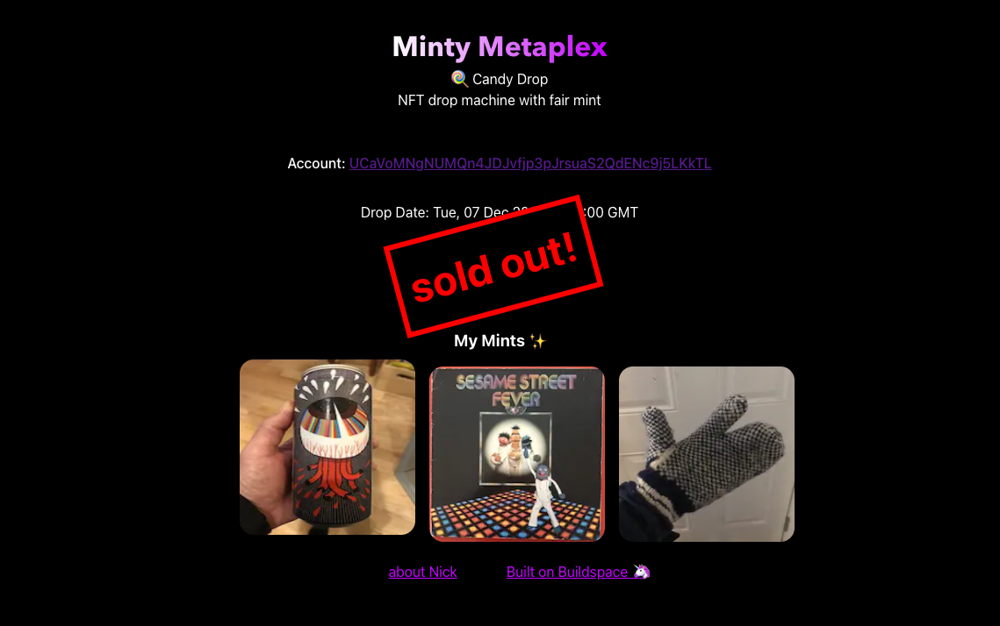

# minty-metaplex

A project I built by following along with the Buildspace Solana/Metaplex project
instructions. Thanks Buildspace!

<center>



</center>

## Prerequisites

Unless you're running this project on Gitpod, the requirements to run this
project are to have the Node.js version installed that corresponds to the
version in `~/.nvmrc` in the root of this project. Using
[nvm](https://github.com/nvm-sh/nvm) is recommended for installing Node.js.
Refer to the
[nvm installation instructions](https://github.com/nvm-sh/nvm#installing-and-updating)
to get `nvm` set up.

Once `nvm` is installed, you can set up the project. If you opt to not use
`nvm`, ensure that the Node.js version specified in `~/.nvmrc` is installed.

## Setup the project

Run the `bin/setup.sh` script to install everything.

There are known issues with the Windows installation using WSL (reminder that
you need WSL installed) and with M1 Macs, so a friendly Google is your best
friend. If you have figured out how to install it properly in those
environments, please
[create an issue](https://github.com/nickytonline/minty-metaplex/issues/new?assignees=&labels=&template=bug_report.md&title=)
and open a PR linked to that issue.

Remember that you can use [Gitpod](#getting-started-gitpod) if you are having
issues with those environments.

## Contributing

If you are interested in contributing to the project, first read our
[contributing guidelines](./CONTRIBUTING.md). Take a look at our
[existing issues](https://github.com/nickytonline/minty-metaplex/issues), or if
you come across an issue,
[create an issue](https://github.com/nickytonline/minty-metaplex/issues/new/choose).
For feature requests,
[start a discussion](https://github.com/nickytonline/minty-metaplex/discussions)
first.

## Getting Started (Local Development)

1. Install the dependencies

   ```bash
   npm install
   # or
   yarn
   ```

1. Start the project

   ```bash
   npm run dev
   # or
   yarn dev
   ```

Open [http://localhost:3000](http://localhost:3000) with your browser to see the
result.

## Getting Started (Gitpod)

The project can be run in Gitpod. Navigate to
https://gitpod.io/#https://github.com/nickytonline/minty-metaplex. If you wish
to load it in Gitpod as an external contributor, you will need to fork the
project first, then open the fork in Gitpod, e.g.
https://gitpod.io/#https://github.com/some_user_that_forked_the_repository/minty-metaplex.

1. Gitpod will take a minute or two to load.
1. If this is the first time loading the project in Gitpod, it will take longer
   as all the npm packages are installing.
1. The project wil start automatically in developer mode and the app will load
   in the Gitpod preview window.

For move information on Gitpod, check out the
[Gitpod documentation](https://www.gitpod.io/docs/).

## Running tests

The project uses [jest](https://jestjs.io). For more information on jest, see
the [official documentation](https://jestjs.io/docs/getting-started).

To run tests:

```bash
npm test
# or
yarn test
```

To run tests in watch mode:

```bash
npm test:watch
# or
yarn test:watch
```

## Building out components

When building out components in the project, shared components can go in the
`components` folder. Components can then be imported using the `@components`
alias, e.g. `import { ExampleHeader } from '@components/Header';`.

### Storybook

The project uses [Storybook](https://storybook.js.org) for building our
components. For more on Storybook, see the
[official documentation](https://storybook.js.org/docs/react).

### Running Storybook

```bash
npm run storybook
# or
yarn storybook
```

### Building Storybook Static Site

```bash
npm run build-storybook
# or
yarn build-storybook
```

## Under the hood

### Solana

A fast blockchain for DeFi, NFTs, Web3 and more. Check out the
[official Solana documentation](https://solana.com/developers).

#### Generate a keypair

Run the following commands to generate a keypair for Solana which will confirm
the address and output the Solana configuration

```
solana-keygen new -s
solana address
solana config get
```

#### Airdrop yourself some SOL on the devnet

If you're working on the devnet, it's handy to airdrop yourself some SOL. You
can do the same thing for localhost if you need to.

```
solana config set --url devnet
solana airdrop 5 $ Add your address at the end if it's for a specific account
solana balance
```

For any questions in regards to the commands above, refer to the official Solana
documentation.

### Next.js

This is a [Next.js](https://nextjs.org/) project bootstrapped with
[`create-next-app`](https://github.com/vercel/next.js/tree/canary/packages/create-next-app).

You can start editing the page by modifying `pages/index.tsx`. The page
auto-updates as you edit the file.

[API routes](https://nextjs.org/docs/api-routes/introduction) can be accessed on
[http://localhost:3000/api/hello](http://localhost:3000/api/hello). This
endpoint can be edited in `pages/api/hello.ts`.

The `pages/api` directory is mapped to `/api/*`. Files in this directory are
treated as [API routes](https://nextjs.org/docs/api-routes/introduction) instead
of React pages.

To learn more about Next.js, take a look at the following resources:

- [Next.js Documentation](https://nextjs.org/docs) - learn about Next.js
  features and API.
- [Learn Next.js](https://nextjs.org/learn) - an interactive Next.js tutorial.

You can check out
[the Next.js GitHub repository](https://github.com/vercel/next.js/) - your
feedback and contributions are welcome!

### Theme UI

For more on theme UI, check out their
[official documentation](https://theme-ui.com/getting-started).

## Deploy on Vercel

The easiest way to deploy your Next.js app is to use the
[Vercel Platform](https://vercel.com/new?utm_medium=default-template&filter=next.js&utm_source=create-next-app&utm_campaign=create-next-app-readme)
from the creators of Next.js.

Check out our
[Next.js deployment documentation](https://nextjs.org/docs/deployment) for more
details.
